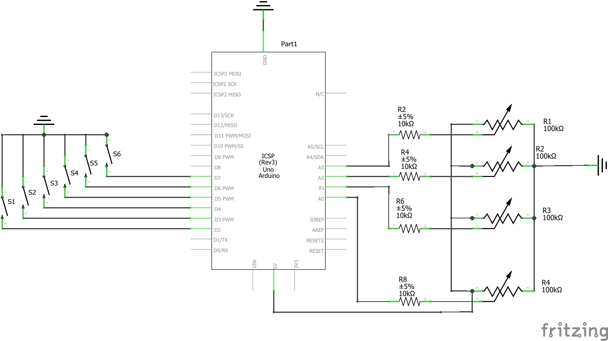
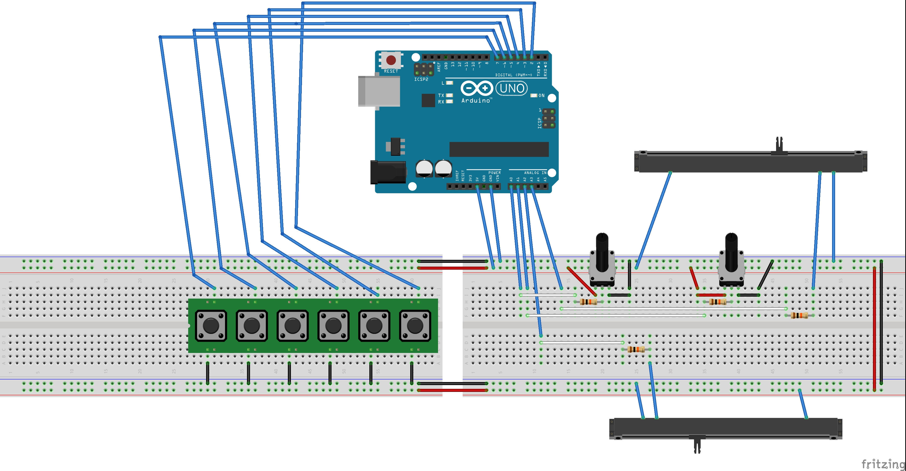

# MIDI Controller
Imagine that you want a piano just for fun but realize that they cost thousands of dollar and there's no way you will spend that much. This project here contains all the basic components of a digital piano and even an LCD display showing the volume and instruments selected. 

| **Engineer** | **School** | **Area of Interest** | **Grade** |
|:--:|:--:|:--:|:--:|
| Yiming Jia | Dougherty Valley High School | Electrical Engineering | Incoming Sophomore


# Demo Night

<iframe width="800" height="450" src="https://www.youtube.com/embed/WNKK-mkF240" title="YouTube video player" frameborder="0" allow="accelerometer; autoplay; clipboard-write; encrypted-media; gyroscope; picture-in-picture" allowfullscreen></iframe>


# Final Milestone

I was basically done with my controller at at the second milestone as I have already finished making the controller and its functions but I wanted to add a display showcasing the instruments so you can see what you have selected. The LCD part I got was an I2C so there was only four ports I needed to plug into and for the vcc part, I soldered my previous 5v wires up to a resistor and the new one to the end of it since I was having crashes from my potentiometers at max value. Once that was completed, I imported the library for LCD I2Cs and used it to output text when the value of the potentiometer for intruments changed. I also didn't know what to do for the second line of the LCD so I added a volume bar and I was able to test out special characters using hexcode for it. I did basically the same thing for what I did for the instruments and checked if the value for it has changed. In the end, my product can produce notes, switch octaves, adjust volume and instruments and have it show up on a display, and other smaller things like the reverb settings and a sustain pedal. 

<iframe width="800" height="450" src="https://www.youtube.com/embed/stWiOH5JV6s" title="YouTube video player" frameborder="0" allow="accelerometer; autoplay; clipboard-write; encrypted-media; gyroscope; picture-in-picture" allowfullscreen></iframe>


# Second Milestone

My second milestone was mainly making the box of the controller and soldering all the wires that connect the buttons to the arduino board. For the box, I didn't have the right tools to cut the circles for my buttons so I just used a compass to map it out and a small scissor to cut it. For the potentiometers and the sliders, the holes were to small to use a compass so I drew the point out and use a pencil to shove a hole out until it's big enough for the potentiometer to fit in. The soldering took a long time for me to get used to but I basically used one type of wire to connect up all the 5v and another for the ground. The other port of the buttons and sliders went to their respective pins and I gave all of them a unique wire. After that I went back to coding and realized my original code didn't work because the I didn't use input pullup with ground and instead used input with 5v so at first random notes played without my control and when I tried playing a note, multiple notes would come out. I eventually figured it out and the potentiometers worked fine.   

<iframe width="800" height="450" src="https://www.youtube.com/embed/Sj6T5Gp7otA" title="YouTube video player" frameborder="0" allow="accelerometer; autoplay; clipboard-write; encrypted-media; gyroscope; picture-in-picture" allowfullscreen></iframe>


# First Milestone

My first milestone was managing to produce a MIDI sound by pressing a button and being able to adjust its volume through a potentiometer. Through coding, I managed to check when the button is being pressed and send out a Serial output which can be converted into MIDI. I also did the same for the potentiometer where it checks if there's a big enough change in the read of the potentiometer and then produce an output which can also be converted into MIDI. Through the MIDI message list, I learned what each of the number outputs does and that allowed the output to correspond with the correct function.

<iframe width="800" height="450" src="https://www.youtube.com/embed/5lB8M1C9zg4" title="YouTube video player" frameborder="0" allow="accelerometer; autoplay; clipboard-write; encrypted-media; gyroscope; picture-in-picture" allowfullscreen></iframe>


# Materials

| **Part** | **Note** | **Price** | **Link** |
|:--:|:--:|:--:|:--:|
| Arduino Uno R3 |  | $25.94 | <a href="https://www.amazon.com/Arduino-A000066-ARDUINO-UNO-R3/dp/B008GRTSV6/"> here </a> |
|:--:|:--:|:--:|:--:|
| LCD I2C | **Important** The SDA and SCL pins are connected to the A4 and A5 pins on the Uno R3, this means that if you are adding an LCD display, you cannot use the A4 and A5 pins at the same time | $11.99 | <a href="https://www.amazon.com/SunFounder-Serial-Module-Display-Arduino/dp/B019K5X53O/"> here </a> |
|:--:|:--:|:--:|:--:|
| Arcade Buttons | Without a mux, you can only use 12 buttons for the controller | $11.00 | <a href="https://www.amazon.com/Avisiri-Buttons-Replace-OBSF-24-Joystick/dp/B07X242Z4D/"> here </a> |
|:--:|:--:|:--:|:--:|
| Rotary Potentiometer | Without a mux, you can only use 4 (6 if you are not using a LCD display) of potentiometers **including** the sliders | $9.99 | <a href="https://www.amazon.com/dp/B07DHL77RT/"> here </a> |
|:--:|:--:|:--:|:--:|
| Slide Potentiometer |  | $13.99 | <a href="https://www.amazon.com/1100PCS-Headers-Connector-Housing-Ltvystore/dp/B07232HGS1/?th=1"> here </a> |
|:--:|:--:|:--:|:--:|
| Container | Any container will work, I just used a square cardboard box at first and then added a smaller one for the LCD, make sure to cut the holes smaller so that the buttons and potentiometer don't end up being wobbly | depends | depends 


# Tools

| **Tool** | **Price** | **Link** |
|:--:|:--:|:--:|
| Soldering Kit | $20.99 | <a href="https://www.amazon.com/Soldering-Iron-Kit-Temperature-Desoldering/dp/B07S61WT16/"> here </a> |
|:--:|:--:|:--:|
| Wire Strippers | $6.99 | <a href="https://www.amazon.com/gp/product/B097STWW4Q/ref=ox_sc_act_title_1?smid=AZ0MMPOLVYF3T&psc=1"> here </a> |
|:--:|:--:|:--:|
| 22 Gauge Wires | $14.94 | <a href="https://www.amazon.com/gp/product/B088KQFHV7/ref=ox_sc_act_title_2?smid=A2WIZBA4LZM5RA&psc=1"> here </a> |


# Schematic





# Code

```c++
/**
 *  
 * @author Yiming Jia
 * @version 7/1/2022
 * 
 * IMPORTANT LINKS
 * Software Wire Library: https://github.com/Testato/SoftwareWire
 * LCD I2C Library: https://github.com/jim3692/Arduino-LiquidCrystal-SoftI2C-library
 * 
 * MIDI Note Table: https://www.inspiredacoustics.com/en/MIDI_note_numbers_and_center_frequencies 
 * MIDI Control Change Table: https://anotherproducer.com/online-tools-for-musicians/midi-cc-list/
 * MIDI Instruments Table: https://en.wikipedia.org/wiki/General_MIDI
 * MIDI Status Bytes List: https://www.midi.org/specifications-old/item/table-2-expanded-messages-list-status-bytes 
 *
 */

#include <SoftwareWire.h>
#include <LiquidCrystal_SoftI2C.h>
#include <Wire.h>

//Custom characters for the volume line
uint8_t volumeBar[8] = {0x1f, 0x1f, 0x1f, 0x1f, 0x1f, 0x1f, 0x1f, 0x1f};
uint8_t volumeOne[8] = {0x1, 0x3, 0x17, 0x17, 0x17, 0x17, 0x3, 0x1};
uint8_t volumeTwo[8] = {0x4, 0x2, 0x11, 0x9, 0x9, 0x11, 0x2, 0x4};


//Change these to whatever you set your pins to
int buttons[] = {2, 3, 5, 4, 6, 7};
int octaveUp = 11;
int octaveDown = 8;
int sustain = 10;

int octave = 0;
int button1State;
int button2State;
int button3State;
int button4State;
int button5State;
int button6State;
int octaveUpState;
int octaveDownState;
int sustainState;
int lastButton1State = HIGH;
int lastButton2State = HIGH;
int lastButton3State = HIGH;
int lastButton4State = HIGH;
int lastButton5State = HIGH;
int lastButton6State = HIGH;
int lastOctaveUp = HIGH;
int lastOctaveDoint lastSustainState = 0;

int sound = A2;
int instrument = A0; 
int reverb = A1; 
//int tremolo = A2; 
int chorus = A3;

int lastSoundValue = 0;
int lastInstrumentValue = 0;
int lastReverbValue = 0;
int lastTremoloValue = 0;
int lastChorusValue = 0;

int lastInstrument = 0;
int lastVolume = 0;

SoftwareWire *wire = new SoftwareWire(12, 13);
LiquidCrystal_I2C lcd(0x27, 16, 2, wire);

void MIDImessage(byte statusByte, byte data1, byte data2){
  Serial.write(statusByte);
  Serial.write(data1);
  Serial.write(data2);
}

int volumeLCD(int volume) {
  lcd.setCursor(2, 1);
  int bars = volume/14;
  if(lastVolume != bars){
    lcd.print("              ");
    lastVolume = bars; 
  }
  for(int i = 1; i <= bars; i += 1){
    lcd.write(0);
wn = HIGH;
  }
  return volume;
}

int instrumentLCD(int instrument){
  lcd.setCursor(0, 0);

  if(instrument != lastInstrument){
    lcd.print("                ");
  }

  //Instruments can be changed to whatever you want by changing return value, follow the MIDI Instruments Table if you are not sure what instruments you want.
  if(instrument == 0){
    lcd.print("Grand Piano");
    lastInstrument = instrument;
    return 0;
  } else if(instrument == 1){
    lcd.print("Bright Piano");
    lastInstrument = instrument;
    return 1;
  } else if(instrument == 2){
    lcd.print("Harpischord");
    lastInstrument = instrument;
    return 6;
  } else if(instrument == 3){
    lcd.print("Xylophone");
    lastInstrument = instrument;
    return 13;
  } else if(instrument == 4){
    lcd.print("Reed Organ");
    lastInstrument = instrument;
    return 20;
  } else if(instrument == 5){
    lcd.print("Electric Guitar");
    lastInstrument = instrument;
    return 26;
  } else if(instrument == 6){
    lcd.print("Acoustic Bass");
    lastInstrument = instrument;
    return 32;
  } else if(instrument == 7){
    lcd.print("Violin");
    lastInstrument = instrument;
    return 42;
  } else if(instrument == 8){
    lcd.print("String Ensemble");
    lastInstrument = instrument;
    return 50;
  } else if(instrument == 9){
    lcd.print("Choir AAAAAAA");
    lastInstrument = instrument;
    return 54;
  } else if(instrument == 10){
    lcd.print("Trumpet");
    lastInstrument = instrument;
    return 58;
  } else if(instrument == 11){
    lcd.print("Tuba");
    lastInstrument = instrument;
    return 60;
  } else if(instrument == 12){
    lcd.print("Alto Sax");
    lastInstrument = instrument;
    return 67;
  } else if(instrument == 13){
    lcd.print("Clarinet (best)");
    lastInstrument = instrument;
    return 73;
  } else if(instrument == 14){
    lcd.print("Flute");
    lastInstrument = instrument;
    return 75;
  } else if(instrument == 15){
    lcd.print("Ocarina");
    lastInstrument = instrument;
    return 81;
  } else if(instrument == 16){
    lcd.print("Square Lead");
    lastInstrument = instrument;
    return 82;
  } else if(instrument == 17){
    lcd.print("Sawtooth Lead");
    lastInstrument = instrument;
    return 83;
  } else if(instrument == 18){
    lcd.print("Synth Pad 1");
    lastInstrument = instrument;
    return 90;
  } else if(instrument == 19){
    lcd.print("Synth Pad 2");
    lastInstrument = instrument;
    return 91;
  } else if(instrument == 20){
    lcd.print("Kalimba");
    lastInstrument = instrument;
    return 110;
  } else if(instrument == 21){
    lcd.print("Steel Drum");
    lastInstrument = instrument;
    return 116;
  }
}

void readButtons(){
  
  button1State = digitalRead(buttons[0]);
  button2State = digitalRead(buttons[1]);
  button3State = digitalRead(buttons[2]);
  button4State = digitalRead(buttons[3]);
  button5State = digitalRead(buttons[4]);
  button6State = digitalRead(buttons[5]);
  octaveUpState = digitalRead(octaveUp);
  octaveDownState = digitalRead(octaveDown);
  sustainState = digitalRead(sustain);

  if(octaveDownState != lastOctaveDown){
    if(lastOctaveDown == HIGH){
      octave -= 6;
      lastOctaveDown = LOW;
      delay(10);
    } else {
      lastOctaveDown = HIGH;
      delay(10);
    }
  }
  
  if(octaveUpState != lastOctaveUp){
    if(lastOctaveUp == HIGH){
      octave += 6;
      lastOctaveUp = LOW;
      delay(10);
    } else {
      lastOctaveUp = HIGH;
      delay(10);
    }
  }

  //You can use a for loop here, I didn't because I had some trouble before with something else and I didn't revert it
  if(button1State != lastButton1State){
    if(lastButton1State == HIGH){
      MIDImessage(144, 60+octave, 127);
      lastButton1State = LOW;
      delay(10);
    } else {
      MIDImessage(128, 60+octave, 0);
      lastButton1State = HIGH;
      delay(10);
    }
  }

  if(button2State != lastButton2State){
    if(lastButton2State == HIGH){
      MIDImessage(144, 61+octave, 127);
      lastButton2State = LOW;
      delay(10);
    } else {
      MIDImessage(128, 61+octave, 0);
      lastButton2State = HIGH;
      delay(10);
    }
  }

  if(button3State != lastButton3State){
    if(lastButton3State == HIGH){
      MIDImessage(144, 62+octave, 127);
      lastButton3State = LOW;
      delay(10);
    } else {
      MIDImessage(128, 62+octave, 0);
      lastButton3State = HIGH;
      delay(10);
    }
  }
  
  if(button4State != lastButton4State){
    if(lastButton4State == HIGH){
      MIDImessage(144, 63+octave, 127);
      lastButton4State = LOW;
      delay(10);
    } else {
      MIDImessage(128, 63+octave, 0);
      lastButton4State = HIGH;
      delay(10);
    }
  }
  
  if(button5State != lastButton5State){
    if(lastButton5State == HIGH){
      MIDImessage(144, 64+octave, 127);
      lastButton5State = LOW;
      delay(10);
    } else {
      MIDImessage(128, 64+octave, 0);
      lastButton5State = HIGH;
      delay(10);
    }
  }
  
  if(button6State != lastButton6State){
    if(lastButton6State == HIGH){
      MIDImessage(144, 65+octave, 127);
      lastButton6State = LOW;
      delay(10);
    } else {
      MIDImessage(128, 65+octave, 0);
      lastButton6State = HIGH;
      delay(10);
    }
  }

  if(sustainState == LOW){
    if(lastSustainState == 0){
      lastSustainState = 1;
      MIDImessage(176, 64, 127);
    } else{
      lastSustainState = 0;
      MIDImessage(176, 64, 0);
    }
  }
  
  
}

void readPots(){
  int difference = 4;
  
  int soundValue = analogRead(sound);
  int instrumentValue = analogRead(instrument);
  int reverbValue = analogRead(reverb);
  //int tremoloValue = analogRead(tremolo);
  int chorusValue = analogRead(chorus);
  
  int soundValueDiff = soundValue - lastSoundValue;
  int instrumentValueDiff = soundValue - lastInstrumentValue;
  int reverbValueDiff = soundValue - lastReverbValue;
  //int tremoloValueDiff = soundValue - lastTremoloValue;
  int chorusValueDiff = soundValue - lastChorusValue;

  //176 is the Channel One Control Change
  //192 is the Channel One Program Change (Instruments)
  
  if (abs(soundValueDiff) > difference)
  {
    MIDImessage(176, 7, volumeLCD(map(soundValue, 0, 1023, 0, 178)));
    lastSoundValue = soundValue;
  }
  if (abs(instrumentValueDiff) > difference)
  {
    MIDImessage(192, 0, instrumentLCD(map(instrumentValue, 0, 1023, 0, 30)));
    lastInstrumentValue = instrumentValue;
  }
  if (abs(reverbValueDiff) > difference)
  {
    MIDImessage(176, 91, map(reverbValue, 0, 1023, 0, 178));
    lastReverbValue = reverbValue;
  }
  //if (abs(tremoloValueDiff) > difference)
  {
   // MIDImessage(176, 92, map(tremoloValue, 0, 1023, 0, 178));
   // lastTremoloValue = tremoloValue;
  }
  if (abs(chorusValueDiff) > difference)
  {
    MIDImessage(176, 93, map(chorusValue, 0, 1023, 0, 178));
    lastChorusValue = chorusValue;
  }

  delay(2);
}

void setup() {
  // put your setup code here, to run once:
  lcd.begin();
  
  Serial.begin(115200);

  for(int i = 0; i < 6; i += 1){
    pinMode(buttons[i], INPUT_PULLUP);
  }
  pinMode(octaveUp, INPUT_PULLUP);
  pinMode(octaveDown, INPUT_PULLUP);
  pinMode(sustain, INPUT_PULLUP);

  pinMode(sound, INPUT);
  pinMode(instrument, INPUT);
  pinMode(reverb, INPUT);
  //pinMode(tremolo, INPUT);
  pinMode(chorus, INPUT);

  lcd.createChar(0, volumeBar);
  lcd.createChar(1, volumeOne);
  lcd.createChar(2, volumeTwo);
  lcd.home();

  lcd.setCursor(0,1);
  lcd.write(1);
  lcd.write(2);
}
  

void loop() {
  // put your main code here, to run repeatedly:
  readButtons();
  readPots();
}
```
